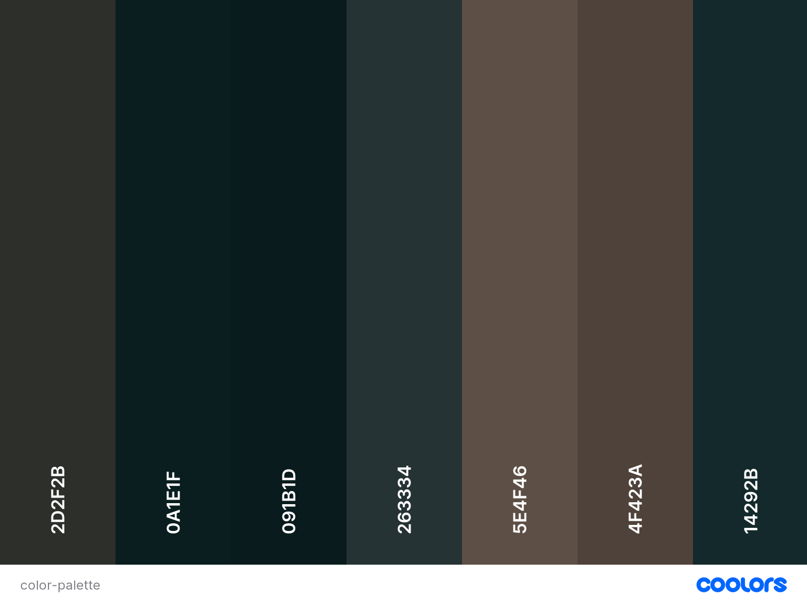
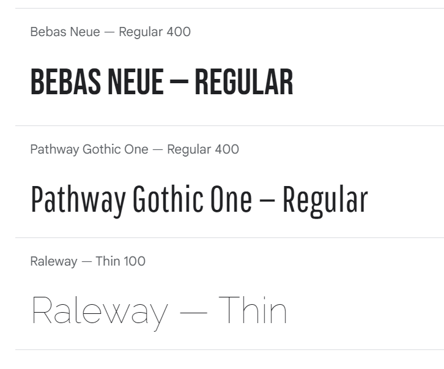
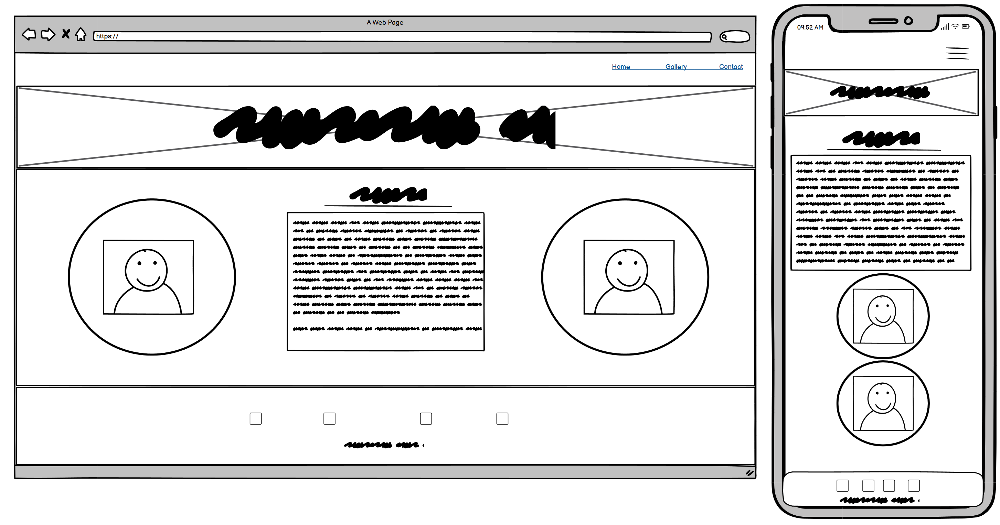
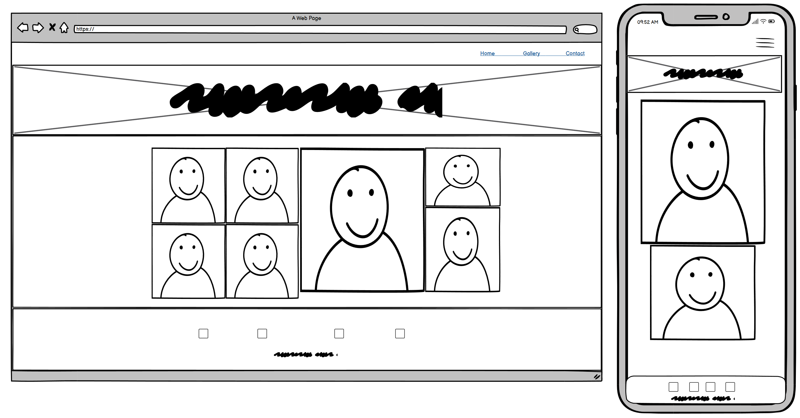
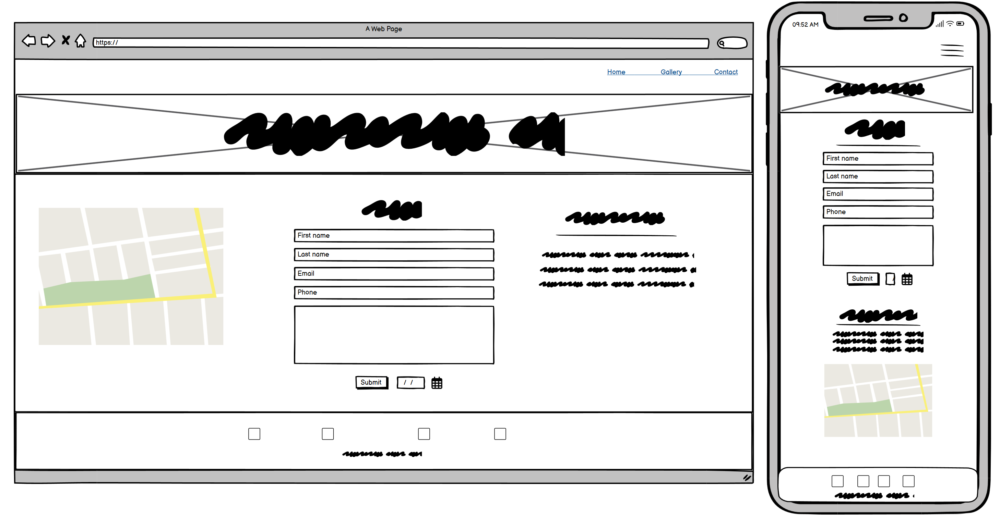

# Studio North

Studio North is an (imaginary) recording studio located in Northern Sweden. This studio is designed to be the perfect oasis for recording music without distractions. The website features a Home page with an 'About us' section, a Gallery page to view photos of the studio itself as well as the locale and surrounding nature. At the Contacts page there is contact information as well as a section to request a booking.

The reason I decided to go with this idea is because of my passion for music, as well as fond memories of my time as an intern in a music studio located in my hometown of Gothenburg, Sweden.

---
Add an image of the finished site here. I like to use [amiresponsive](https://ui.dev/amiresponsive) to get an image of my site on all device sizes, and amiresponsive allows you to click links on the page and scroll, so each device can show a different element of your site.

Add a link to the live site here, for Milestone 1 this will be the GitHub Pages Link from when you deployed the site.

If you want to add optional [shields.io](https://shields.io) badges to your README, I like to add them to this section.

---

## CONTENTS

* [User Experience](#user-experience-ux)
  * [User Stories](#user-stories)

* [Design](#design)
  * [Colour Scheme](#colour-scheme)
  * [Typography](#typography)
  * [Imagery](#imagery)
  * [Wireframes](#wireframes)

* [Features](#features)
  * [General Features on Each Page](#general-features-on-each-page)
  * [Future Implementations](#future-implementations)
  * [Accessibility](#accessibility)

* [Technologies Used](#technologies-used)
  * [Languages Used](#languages-used)
  * [Frameworks, Libraries & Programs Used](#frameworks-libraries--programs-used)

* [Deployment & Local Development](#deployment--local-development)
  * [Deployment](#deployment)
  * [Local Development](#local-development)
    * [How to Fork](#how-to-fork)
    * [How to Clone](#how-to-clone)

* [Testing](#testing)

* [Credits](#credits)
  * [Code Used](#code-used)
  * [Content](#content)
  * [Media](#media)
  * [Acknowledgments](#acknowledgments)

---

## User Experience (UX)

👩🏻‍💻 View an example of a completed user experience section [here](https://github.com/kera-cudmore/Bully-Book-Club#user-experience-ux)

### User Stories

Add your user stories here. You want to include first time visitors and returning visitors here as a minimum. Think about each group, and the experience and journey you want them to have on your site. It really helps to think about this before you start coding, and will really help with creating your wireframes.

## Design

### Colour Scheme

I've generated a color palette based off of the hero image, which I thought would be a well suited color scheme for the full website. 

[Coolors.co](https://coolors.co/) Is the website I've used to generate the colour palette.

### Typography

I wanted to go with a sleek typography, and decided to go with Bebas Neue, Pathway Gothic One and Raleway, all of which I thought fitted well together. 

We can see Raleway being used on the hero image "Studio Northern Lights". Pathway Gothic One is used as paragraph text, and Bebas Neue as lesser headers.

### Imagery

As the studio is located in a rural forest-y area in northern Sweden, I've chosen to use images that gives a warm and earthy feel. 

### Wireframes

The Wireframes I've made was created for desktop and mobile view. The original design I made has changed slightly, and the images below represent the new changes - which I have also tried my best to implement on the live site. 

I ended up not going for the calendar button in the end and settled for just the submit button.

## Features

👩🏻‍💻 View an example of a completed user experience section [here](https://github.com/kera-cudmore/TheQuizArms#Features)

This section can be used to explain what pages your site is made up of.

### General features on each page

If there is a feature that appears on all pages of your site, include it here. Examples of what to include would the the navigation, a footer and a favicon.

I then like to add a screenshot of each page of the site here, i use [amiresponsive](https://ui.dev/amiresponsive) which allows me to grab an image of the site as it would be displayed on mobile, tablet and desktop, this helps to show the responsiveness of the site.

### Future Implementations

What features would you like to implement in the future on your site? Would you like to add more pages, or create login functionality? Add these plans here.

### Accessibility

I have tried my best to be mindful of accessibility, and the steps I've taken for this are the following:

- Descriptive information about every image in the gallery page. 
- Aria labels to the social media links.
- Thought of a good contrast throughout the website.

Have you chosen fonts that are dyslexia/accessible friendly?

Code Institute have an amazing channel for all things accessibility (a11y-accessibility) I would highly recommend joining this channel as it contains a wealth of information about accessibility and what we can do as developers to be more inclusive.

## Technologies Used

### Languages Used

HTML & CSS.

### Frameworks, Libraries & Programs Used

I've used Gitpod for the actual programming, as well as creating a repository for my project in Github. 

Wireframes were created with Balsamic. 

For the iframe I've used https://google-map-generator.com/.

The images I've converted from avif files to jpg with Microsoft Paint (as I thought that would make the images take up less data but I might have gotten it wrong). The header image I've also used Canva for adding a colour tint. Original header picture below. 

Header image with tint and slightly cropped: 

## Deployment & Local Development

👩🏻‍💻 View an example of a completed Deployment & Local Development section [here](https://github.com/kera-cudmore/TheQuizArms#Deployment)

### Deployment

[Live site here](https://nicolemne.github.io/project-portfolio-1/)

### Local Development

The local development section gives instructions on how someone else could make a copy of your project to play with on their local machine. This section will get more complex in the later projects, and can be a great reference to yourself if you forget how to do this.

#### How to Fork

Place instructions on how to fork your project here.

#### How to Clone

Place instructions on how to clone your project here.

## Testing

### Solved Bugs

I've encountered several "bugs" on the journey of making this website, and most of them I've corrected by seeking help online. 

Some bugs I've encountered and fixed: 

- Header text not showing up on top of the hero image. 
- Footer not sticking to bottom of the page 
- Image of the house on index.html not showing up
- Header text not being centered

## Credits

The Love Running project has been a design inspiration for my own project.
The help I've used with syntax and formatting, please see links and description below.

### Code Used

[How to stick footer to bottom of page](https://dev.to/nehalahmadkhan/how-to-make-footer-stick-to-bottom-of-web-page-3i14)

[How to position text above an image](https://www.w3schools.com/HOWTO/howto_css_image_text.asp)

[How to style inputs](https://www.w3schools.com/css/css_form.asp)

[Cursor in the middle of text area](https://stackoverflow.com/questions/9070924/cursor-in-the-middle-of-a-textarea-box)

[How to center div inbetween two divs](https://stackoverflow.com/questions/3172738/centering-a-div-between-one-thats-floated-right-and-one-thats-floated-left)

### Content

I have written all content on the website. All of it being made up for the educational purpose, as this is not a real studio for hire. My boyfriend Daniel has helped me with a descriptive text in the paragraph "About us". 

###  Media

All images are royalty free and has been taken from [Pexels](https://www.pexels.com/sv-se/) and [Unsplash](https://unsplash.com/).
  
###  Acknowledgments

If someone helped you out during your project, you can acknowledge them here! For example someone may have taken the time to help you on slack with a problem. Pop a little thank you here with a note of what they helped you with (I like to try and link back to their GitHub or Linked In account too). This is also a great place to thank your mentor and tutor support if you used them.